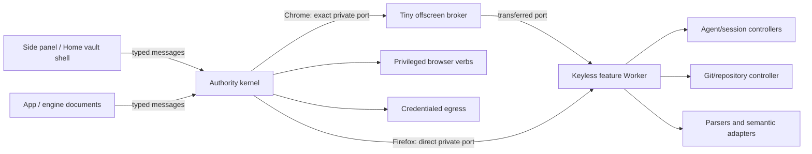

# Thin background architecture

Status: implementation in progress. The manifest still boots the all-in-one
background as the compatibility reference. The repository split, native API
surface, cold UI shell, listener inventory, controller protocol, demand-only
feature leases, and executable performance policy have landed. The Chrome
offscreen document is an operation-lazy supervisor; the authority-kernel
cutover has not.

## Why this is an architecture change

The v0.7.3 Store background statically reaches 458 modules and 2.06 MB after
release minification. Its source graph is 4.70 MB. A cold Chrome profile has
taken 30 seconds to reach the first background statement and has also failed to
reply inside 100 seconds. Firefox uses an event page rather than Chrome's MV3
worker; a corrected installed-addon probe is much faster, but it still pays for
the same eager graph.

Combining the current graph into one file is not the answer. Chrome prototypes
of both readable and minified one-file builds failed to reply inside 45-100
seconds. A Firefox one-file build likewise failed its 30-second liveness budget.
The work is dominated by eager compilation, evaluation, construction, and boot
side effects, not just module linking.

The first production extraction makes that distinction concrete. Moving the
repository/isomorphic-git owner behind an operation-lazy host and removing the
unneeded compatibility API implementation reduced the Store Chrome service
worker from 2.06 MB to 1.71 MB without changing its 452-module architectural
shape enough to cure the tail. In a fresh seven-profile packaged rerun, only
three profiles became actionable; successful vault gates ranged from 35.5 to
65.2 seconds and four profiles timed out at 90 seconds. The static vault shell
painted in every sample. Those timeouts are historical failure evidence, not
performance samples or an allowed latency. This is useful progress and a hard
rejection of a smaller monolith as the destination.

The complementary document-side extraction is already at the intended shape:
the authored offscreen cold graph fell from 72 modules / 865 KB to 5 modules /
about 51 KB, and the exact Store and Preview Chrome packages each ship an
18.2 KB cold graph. Actor runners, code jobs, repository/Git, document parsers,
local inference and the Preview dweb coordinator load only after an authenticated
operation or explicit long-lived mesh lease. The full Chrome in-browser suite
passes against that split.

A listener-only Chrome kernel establishes the opposite floor: its first
statement was reached in 11-531 ms across three fresh profiles and its first
route replied 5.9-6.9 seconds after the whole browser launch. That prototype is
not functional, but it proves that the privileged entry must become small and
that the remaining browser-launch/UI budget is tight.

## Chosen topology

Chrome and Firefox share a kernel protocol and feature Workers. They do not
pretend that their background hosts have the same lifecycle.

Chrome's service worker cannot dynamically import packaged feature modules.
It creates an offscreen broker only for an active feature lease. The broker is
not a second monolith: it imports no agent loop, tool catalog, Git engine,
parser, dweb controller, local model, or voice engine statically. It transfers
a private channel to a dedicated feature Worker.

Firefox's non-persistent event page creates the same feature Worker directly.
This keeps heavy semantics out of the key-holding background Window while
letting both browsers share controllers, envelopes, fault tests, and recovery
rules. DOM, media, WebGPU, and voice operations remain in narrowly scoped
document adapters.

Vault cryptography follows a dedicated authority-realm form and is absent from
the native kernel graph. Chrome creates the offscreen supervisor only after an
exact human vault operation and transfers one private MessagePort to the fixed
sealed `vault-authority-worker.js`; Firefox creates that Worker directly. The
Worker retains the vault data key and secret plaintext only while unlocked.
The kernel retains exact storage, audit, ceremony admission, sender provenance,
and feature-lease authority. Passphrase, PRF output, wrapped keys, salts, and
derived bytes never use runtime messaging.

The authority Worker seals network, extension, storage, broadcast, and nested-
Worker capabilities before its fixed packaged dynamic import. Argon2 remains a
second-level literal import and is compiled only for passphrase operations, so
passkey users do not pay for it. Lock closes the Worker and its feature lease;
a successor kernel starts a fresh sealed realm and resumes only from the
bounded session mirror. The Worker, runtime, and Argon2 source are explicit
lazy entries in the package inventory and controller content digest, so demand
loading cannot hide or substitute their bytes.

## Authority placement

The kernel is deliberately more than a message forwarder. Moving these duties
would turn a startup optimization into an authority regression.

The kernel owns:

- synchronous registration of runtime message/connect, action, command, tab,
  navigation, alarm, startup, install, update, and storage listeners;
- Firefox's synchronous blocking request and child-window guards;
- exact sender URL, document, tab, port, App instance, actor root, origin, and
  target validation at ingress and again after every asynchronous boundary;
- vault ceremony admission, exact reverse storage, posture, audit, and lock
  dominance. The sealed vault authority Worker retains the data key and secret
  plaintext only for the unlocked lease; neither the semantic controller nor
  the offscreen supervisor receives them. Nonextractable DPoP handles and
  device signing keys remain behind their own kernel-owned custody seams;
- redirect-by-redirect safe fetch, private-network and denylist enforcement,
  exact-origin credential injection, and privileged audit;
- confirmation ownership, Plan/Act posture, positive capability grants,
  cancellation, spend/quota preflight, and App actor authority digests;
- a compact mapping from semantic operations to privileged verbs and minimum
  replay class. A feature host may narrow authority, never expand it;
- the durable accepted/committed/settled operation ledger, immediate Stop and
  lock behavior, tab/DNR custody, and exact privileged browser verbs.

The sender matrix is fail-closed and target-neutral: first-party requires the
exact runtime id and packaged origin; offscreen/background/Sidepanel/Home/
Options/Eval predicates additionally pin exact document paths and the expected
tab or document provenance. Hashes are accepted only on routed UI documents;
queries, suffix paths, tab-hosted offscreen copies, missing trust inputs, and
cross-extension or web-page senders are rejected. Executable matrix tests are
the source of truth; the cold-path implementation intentionally keeps only the
rules and JSDoc types, with this document carrying the longer rationale.

Feature Workers own keyless semantic growth:

- agent turns, prompts, model/provider selection semantics, history, memory,
  tool descriptions, and nonprivileged orchestration;
- repository and isomorphic-git computation, the single repository mutation
  queue, App/library controllers, parsers, and dweb catalog semantics;
- normalized requests for a kernel-owned credentialed Git/provider transport.
  Raw credentials never cross the channel.

The minimal side-panel and Home shell own first paint, vault status, and the
unlock/enrollment CTA. Chat, Library, App development, and provider UI load
only after that shell is actionable.

No release bundle is part of this architecture. The authority kernel remains a
small native module graph, and every demand-loaded entry is a fixed literal in
the packaged lazy-entry inventory. Semantic dispatch is split again by route
family: loading actor views does not evaluate contacts, toolbox, Git, artifact,
model, or future route clusters. Each cluster has its own static dependency
closure and is included independently in the controller build digest. A new
feature grows one reviewed cluster instead of a central background or a second
offscreen monolith.

The cold entry also has an executable single-owner event registry. Each small
kernel module claims an exact browser event by inventory key; a second owner,
different raw event object, or target-inapplicable registration fails before a
listener is added. Chrome, Firefox, and Preview use target-derived Port sets:
Chrome owns the offscreen lease heartbeat, Firefox owns the private-transfer
runtime Port fallback, and only Preview Chrome owns dweb custody. This avoids a
generic event bus and prevents browser-specific channels from becoming either
false cutover blockers or accidental authority paths.

Durable cold receipts use a separate recovery registry. It folds captured
events into per-owner counts and asks the owner to re-read current browser and
storage state; it never hands old URLs, storage values, or raw browser events
to a feature controller. Queue overflow invokes every registered reconciler in
inventory order. Duplicate recovery owners and unknown event keys fail closed.
The one explicit non-state exception is Preview Chrome's downloaded-update
version: the browser cannot re-emit or query it after a worker dies, so recovery
passes only that already-sanitized dotted version to the kernel update-custody
owner. The owner persists it before acknowledgement and compares it with the
successor manifest, preventing a stale receipt from causing a reload loop.

The native entry does not import the legacy generic capture/fan-in host. Its
kernel-local receipt queue wraps each single-owner browser event directly,
persists only the fixed inventory sanitizer output, and adopts unfinished
receipts across a new kernel identity for current-state reconciliation. It has
no message dispatcher, pending Port set, semantic-host attachment, or generic
RPC path. The broader fan-in remains only as a differential migration harness
for the compatibility worker and cannot enter the final cold graph.

Tab/navigation authority and non-tab lifecycle wakes are separate owner
modules. The tab owner keeps creation, navigation-target, update, removal,
activation, and Firefox blocking decisions synchronous. The lifecycle owner
returns startup, alarm, Firefox session-change, and Preview update Promises to
the cold fan-in so durable receipts settle only after their injected current-
state consumer completes. Neither module imports a route or feature barrel.

## Native module scalability rule

The service worker is not bundled. Module count is treated as a real browser
cost, but it is not reduced by merging unrelated feature code into one source
file. The binding rule is instead:

1. One small authority adapter per feature family. It may validate provenance,
   read or write the exact kernel-owned store, and mint a route-bound grant.
2. One shared semantic controller gateway per kernel generation. Feature
   adapters register an exact reverse-operation handler before the first call;
   duplicate or late registration fails closed. This prevents independent
   modules from creating competing controller channels.
3. One fixed-literal lazy host entry per feature family. Chrome loads it in a
   sealed Worker behind a bounded named lease; Firefox loads the same entry in
   its direct sealed Worker. Settlement retires the bounded Chrome realm, and
   vault lock retires the shared gateway on both browsers.
4. No feature barrel in the cold graph. Adding Contacts must not make Actors,
   Toolbox, Git, artifacts, providers, or the agent loop reachable. Packaging
   walks and digests every fixed lazy entry independently.
5. Byte, direct-edge, and forbidden-import ceilings remain authoritative. The
   native-module ceiling reflects reviewed cluster seams; it is not an excuse
   to pull a rich implementation into the first wake.

The executable thin entry currently demonstrates this shape with four
independent demand clusters: Actors (bounded live-card projection), Contacts
(kernel-owned overlays/App catalog/audit plus a lazy pure merge), Provider
status (kernel-owned secret posture plus a compact fixed descriptor leaf), and
Toolbox (kernel-owned module bodies/run counters plus lazy route shaping).
The native status route does not start the controller host. The compatibility
semantic host consumes the same descriptor leaf instead of importing the
provider adapter barrel, so first onboarding no longer pulls the 25-module
provider implementation closure merely to render names and masked key state.
Provider key writes and live credential verification remain local Class-E
kernel effects; the host receives only `hasKey` and a bounded masked preview.
Verification uses a fixed provider-specific endpoint, request shape, response
cap, and deadline, coalesces an identical in-flight probe, and is aborted on
vault lock. A lost post-dispatch reply is outcome-unknown and is never
automatically replayed. Exact-value key saves are idempotent, so the UI can
resume only the interrupted save/test/selection phase without repeating a
different effect. The Toolbox authority reader shares the
durable IDB schema but does not import Toolbox parsing, prompt rendering, or
write semantics. The same metadata-only rule serves slash-command names,
enabled skill descriptions, and App file paths: command/skill bodies and App
bytes remain demand-loaded.

It also owns vault/session/system reads, App catalog list/favorite metadata,
and a lazy fail-closed denylist projection for the composer tab picker. The
current native graph is 76 modules, 442,710 authored bytes, a 28,013-byte
entry, and 26 direct imports; all 69 routes marked migrated are executable
from that entry. Their fixed host
implementations remain absent from the static service-worker closure. The
generated ledger still blocks manifest cutover for every unavailable route; a
working pilot cluster does not weaken that all-route gate.

Preview Chrome's update event is also executable without importing the rich
legacy update module. The native owner synchronously captures the browser wake,
persists the exact version in session storage, and reloads only after an exact
window-client scan and a second feature-work check both report quiet. Deferred
installs use bounded backoff and retry again when a UI surface disconnects.
Store Chrome and every Firefox target physically omit the listener.

## Private host protocol

Every request carries a protocol version, build digest, kernel and host epochs,
request ID, operation, absolute deadline, grant ID, and monotonic sequence.
Owner, session, App/actor instance, origin, target, and replay class are stamped
by the kernel. Values supplied by a feature host are never treated as authority.

The transferred port is part of the grant. A grant is bound to the exact port,
both epochs, operation, owner, and target, and expires on settlement or cancel.
Handshake fails closed unless the feature realm proves the expected build and
sealed Worker environment without `window`, `document`, `chrome`, `browser`,
raw `fetch`, WebSocket/EventSource/XHR, IndexedDB, CacheStorage, SharedWorker,
`importScripts`, `sendBeacon`, or the ambient OPFS root. The realm seal executes
before any controller dependency. A repository Worker receives only a scoped
directory handle and a kernel-owned audited HTTP adapter; it cannot discover
other App/repository data or bypass egress policy. A dependency that cannot run
sealed moves to a separately reviewed adapter instead of widening every host.

Effects follow `accepted -> committed -> settled`:

- before commit, cancellation or host loss is known not to have run;
- after commit, a missing receipt is outcome-unknown and must not be replayed;
- a Class-A semantic read may retire a lost host and retry exactly once with a
  fresh one-shot grant; a Class-E effect is never replayed by that recovery;
- duplicate request IDs coalesce onto the first operation;
- late results, stale epochs, sequence regressions, oversized messages, and
  expired grants are rejected;
- binary Git/App data uses transferred `ArrayBuffer` chunks, never JSON/base64.

The current repository extraction is deliberately transitional: Chrome owns
Git in an authenticated operation-lazy offscreen module, Firefox imports the
same controller on first use, and the exact packaged binary/OPFS workflow is
covered in-browser. The controller protocol now supports parent-bound reverse
kernel calls and retains an uncatchable nested outcome-unknown bit. The next
repository slice moves its data path from runtime-message base64 into that
private transferred-buffer channel and gives the sealed Worker only a scoped
repository handle. Documentation does not treat the transitional transport as
the finished security boundary.

The protocol state machine and fault suite are shared. Only the Chrome
offscreen and Firefox direct-Worker lifecycle adapters differ.

## Durable-store registry

Store lifetime (`session`, `profile`, `portable`) is independent of transfer
authority. File portability is narrower than cryptographically verified
self-device sync: conversations and executable App artifacts may sync to a
proven same-person device without becoming hand-carried JSON material.
Device-bound keys are never portable. Version stamps are stored as one atomic
map; fresh surfaces may be stamped, while older, newer, or malformed stamps are
retained read-only until an explicit migration exists.

## Migration without functional forks

1. Perfect the packaged benchmark and keep temporary no-growth graph ratchets.
2. Add the tiny kernel, minimal vault state, and real side-panel/Home vault
   shell. Preserve the legacy graph as the differential behavior oracle.
3. Land the versioned channel, Chrome broker, Firefox direct adapter, and fault
   suite before moving a privileged feature.
4. Move the repository engine as one unit. Keep OPFS paths, mutation ordering,
   binary bytes, cancellation, GitHub auth, import/export, and operation custody
   identical. The kernel injects Git credentials only into an exact normalized
   Smart-HTTP repository request.
5. Move agent/session/provider/tool semantics. The kernel retains model,
   provider, actor/root/instance, authority, confirmation, egress, and replay
   enforcement.
6. Move parsers, dweb catalogs, local model, and remaining controllers into
   feature-specific Workers or document adapters.
7. Remove the legacy background graph, unconditional offscreen creation, and
   perpetual heartbeat. Keep the already-small kernel as native modules; the
   release may minify individual files but must not combine feature clusters
   into the cold entry.

Each slice must pass route-inventory parity, base-versus-candidate fixtures,
real Chrome and Firefox extension tests, and crash/cancel/restart fault tests.
No timing improvement can waive an authority or lifecycle failure.

Cold authority modules keep executable contracts, JSDoc types, and short local
rationales in source. Longer design histories and repeated section narration
live in this document instead: Chrome fetches and parses authored module bytes
on every cold worker generation, so prose embedded throughout the authority
graph is part of the startup cost. This is source modularity, not a minifier or
bundle exception; feature implementations and their documentation remain lazy,
independently addressed files.

## Required budgets

[cold-start-budgets.js](../scripts/bench/cold-start-budgets.js) is the single
numeric source of truth for authored and packaged graph ceilings, timing
limits, lane cardinality, and the temporary no-growth ratchets. The pure
[cold-start-policy.mjs](../scripts/bench/cold-start-policy.mjs) consumes those
values when it validates raw browser reports. Numeric policy does not live in
prose because documentation must not reserve headroom or drift away from the
executable release gate. A budget edit receives the same review as an
authority-boundary change.

The static graph, lazy-entry closure, and benchmark-policy tests are in ordinary
preflight and CI. A separate secretless packaged-browser job is required by the
release job and runs on ready PRs, main, and release tags. Every raw sample must
reach actionable UI within 3 seconds, and the packaged service-worker graph
must remain at or below the 300 KB release ceiling. The 200 KB figure is an
aspirational simplification goal, not an enforcement threshold. A 10-second
watchdog terminates failed probes; it is never summarized as performance.
Fresh browser launch and forced worker wake are separately labeled boundaries
on the host monotonic clock; realm-relative worker age is diagnostic only. Each
graph is bound to its own immutable archive and unpacked-tree digest, and the
harness proves those bytes did not change during measurement.

Absolute release evidence is still not target-cutover comparison evidence. The
report records the unmet interleaved candidate/base gate. `packageArtifact`
accepts disjoint source and artifact roots, and the harness has an explicit
local comparison mode that materializes both commits from Git archives,
packages them with the candidate toolchain, binds input/output digests, and
alternates base-first/candidate-first per sample on the same host. Historical
base packaging may exceed today's ceiling; the candidate cannot. Required
PR/main/release lanes enforce the absolute 3-second/300-KB safety gate while a
reviewed physical paired run remains necessary to change the target-cutover
flag. There are no partial sample sets, selective retries, mutable input trees,
or self-reported candidate baselines.

The existing passkey signup driver remains the Chrome end-to-end WebAuthn PRF
authority. It must run against the exact packaged artifact and report vault
shell paint, CTA enabled, ceremony, credential return, and durable commit as
separate phases. Firefox must not claim passkey coverage by substituting a
passphrase; if its pinned WebDriver cannot automate PRF, that limitation is
reported explicitly while its bootstrap, CTA, passphrase, and idle-discard
timings remain required.
